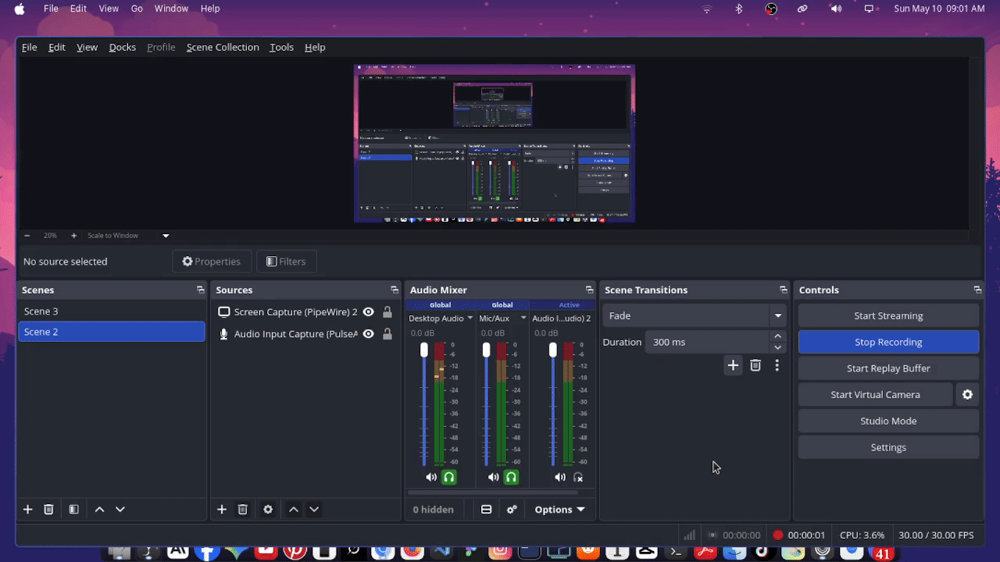

# http-server_zig
 

<p align="center">
  
</p>

<p align="center">
  <a href="https://github.com/you/zig-http-server/stargazers">
    
  </a>
  <a href="https://ziglang.org/">
    
  </a>
  <a href="LICENSE">
    
  </a>
</p>
<p align="center">
A lightweight HTTP server written in <a href="https://ziglang.org/">Zig</a> — no libc, no frameworks, just raw sockets and clean code.
</p>


 
```sh
# Clone
git clone https://github.com/you/zig-http-server
cd zig-http-server
 
# Build & run
zig build run
```

``` 
Server starts on http://localhost:3490
 ```


🪪 License
MIT — do whatever you want with it.
